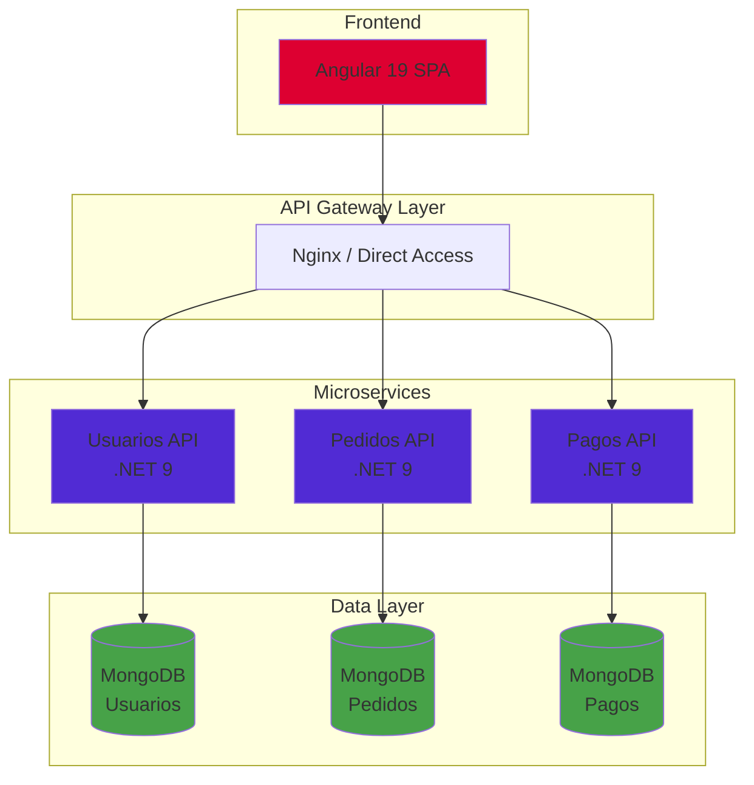

# 🚀 Sistema de Gestión de Pedidos - Microservicios

[](https://dotnet.microsoft.com/)
[](https://angular.io/)
[](https://www.mongodb.com/)
[](https://www.docker.com/)

## 📋 Descripción

Sistema MVP de gestión de pedidos desarrollado con arquitectura de microservicios, diseñado para la empresa ABC como parte de su proceso de migración tecnológica. El proyecto demuestra buenas prácticas de desarrollo, arquitectura limpia y patrones de diseño empresariales.

## 🏗️ Arquitectura



## 🎯 Justificación Técnica

### ¿Por qué Microservicios?

| Aspecto | Beneficio |
|---------|-----------|
| **Escalabilidad** | Cada servicio escala independientemente según demanda |
| **Despliegue** | CI/CD independiente por servicio |
| **Resiliencia** | Fallo aislado, el sistema continúa operando |
| **Tecnología** | Libertad de elegir stack por servicio |
| **Equipos** | Desarrollo paralelo sin dependencias |

### ¿Por qué Base de Datos por Servicio?

- **Acoplamiento Bajo**: Cada servicio es dueño de sus datos
- **Autonomía**: Cambios de esquema sin afectar otros servicios
- **Optimización**: Modelo de datos específico por dominio
- **Consistencia**: Patrón Database per Service

### ¿Por qué REST?

- **Simplicidad**: Protocolo HTTP estándar
- **Interoperabilidad**: Compatible con cualquier cliente
- **Cacheabilidad**: HTTP caching nativo
- **Documentación**: OpenAPI/Swagger automático

### ¿Por qué Clean Architecture?

```
┌─────────────────────────────────────┐
│           Presentation              │  ← Controllers, DTOs
├─────────────────────────────────────┤
│           Application               │  ← Use Cases, Services
├─────────────────────────────────────┤
│             Domain                  │  ← Entities, Interfaces
├─────────────────────────────────────┤
│          Infrastructure             │  ← MongoDB, External APIs
└─────────────────────────────────────┘
```

- **Independencia**: El dominio no conoce detalles externos
- **Testabilidad**: Capas desacopladas, fácil testing
- **Mantenibilidad**: Cambios localizados por capa
- **Flexibilidad**: Cambiar infraestructura sin tocar negocio

## 📁 Estructura del Repositorio

```
/
├── frontend/                    # Angular 19 SPA
│   ├── src/
│   │   ├── app/
│   │   │   ├── core/           # Guards, Interceptors, Services
│   │   │   ├── features/       # Módulos por funcionalidad
│   │   │   ├── shared/         # Componentes compartidos
│   │   │   └── layout/         # Layout principal
│   │   └── environments/
│   └── Dockerfile
│
├── backend/
│   ├── usuarios/               # Microservicio de Usuarios
│   │   ├── src/
│   │   │   ├── Usuarios.Domain/
│   │   │   ├── Usuarios.Application/
│   │   │   ├── Usuarios.Infrastructure/
│   │   │   └── Usuarios.API/
│   │   └── Dockerfile
│   │
│   ├── pedidos/                # Microservicio de Pedidos
│   │   ├── src/
│   │   │   ├── Pedidos.Domain/
│   │   │   ├── Pedidos.Application/
│   │   │   ├── Pedidos.Infrastructure/
│   │   │   └── Pedidos.API/
│   │   └── Dockerfile
│   │
│   └── pagos/                  # Microservicio de Pagos
│       ├── src/
│       │   ├── Pagos.Domain/
│       │   ├── Pagos.Application/
│       │   ├── Pagos.Infrastructure/
│       │   └── Pagos.API/
│       └── Dockerfile
│
├── arquitectura/               # Documentación técnica
│   ├── DECISIONS.md
│   └── diagrams/
│
├── docker-compose.yml
└── README.md
```

## 🚀 Inicio Rápido

### Prerrequisitos

- Docker Desktop 4.x+
- Docker Compose 2.x+

### Ejecutar con Docker

```bash
# Clonar el repositorio
git clone <repository-url>
cd NexosSoftware

# Construir y levantar todos los servicios
docker-compose up --build

# O en modo detached
docker-compose up --build -d
```

### URLs de Acceso

| Servicio | URL | Descripción |
|----------|-----|-------------|
| **Frontend** | http://localhost:4200 | Angular SPA |
| **Usuarios API** | http://localhost:5001/swagger | Swagger UI |
| **Pedidos API** | http://localhost:5002/swagger | Swagger UI |
| **Pagos API** | http://localhost:5003/swagger | Swagger UI |

### Credenciales de Prueba

| Usuario | Contraseña | Rol |
|---------|------------|-----|
| admin | admin123 | Admin (acceso completo) |
| usuario | user123 | Usuario (acceso limitado) |

### Health Checks

```bash
# Verificar estado de los servicios
curl http://localhost:5001/health
curl http://localhost:5002/health
curl http://localhost:5003/health
```

## 🔌 API Externa Integrada

El frontend consume datos de la API pública:

**JSONPlaceholder**: https://jsonplaceholder.typicode.com

- `/users` - Lista de usuarios
- `/posts` - Lista de publicaciones
- `/todos` - Lista de tareas

## 📸 Capturas de Pantalla

### Login


### Dashboard Admin


### Dashboard Usuario


### Modo Oscuro


## 🛠️ Comandos Útiles

```bash
# Ver logs de todos los servicios
docker-compose logs -f

# Ver logs de un servicio específico
docker-compose logs -f usuarios-api

# Detener todos los servicios
docker-compose down

# Limpiar volúmenes (bases de datos)
docker-compose down -v

# Reconstruir un servicio específico
docker-compose up --build usuarios-api
```

## 📊 Endpoints por Servicio

### Usuarios API (Puerto 5001)

| Método | Endpoint | Descripción |
|--------|----------|-------------|
| GET | /health | Health check |
| GET | /status | Estado del servicio |
| GET | /api/usuarios | Listar usuarios |
| GET | /api/usuarios/{id} | Obtener usuario |
| POST | /api/usuarios | Crear usuario |
| PUT | /api/usuarios/{id} | Actualizar usuario |
| DELETE | /api/usuarios/{id} | Eliminar usuario |

### Pedidos API (Puerto 5002)

| Método | Endpoint | Descripción |
|--------|----------|-------------|
| GET | /health | Health check |
| GET | /status | Estado del servicio |
| GET | /api/pedidos | Listar pedidos |
| GET | /api/pedidos/{id} | Obtener pedido |
| POST | /api/pedidos | Crear pedido |
| PUT | /api/pedidos/{id} | Actualizar pedido |
| DELETE | /api/pedidos/{id} | Eliminar pedido |

### Pagos API (Puerto 5003)

| Método | Endpoint | Descripción |
|--------|----------|-------------|
| GET | /health | Health check |
| GET | /status | Estado del servicio |
| GET | /api/pagos | Listar pagos |
| GET | /api/pagos/{id} | Obtener pago |
| POST | /api/pagos | Crear pago |
| PUT | /api/pagos/{id} | Actualizar pago |
| DELETE | /api/pagos/{id} | Eliminar pago |

## 🧪 Testing

```bash
# Ejecutar tests del backend
cd backend/usuarios && dotnet test
cd backend/pedidos && dotnet test
cd backend/pagos && dotnet test

# Ejecutar tests del frontend
cd frontend && npm test
```

## 📝 Licencia

Este proyecto fue desarrollado como prueba técnica para la empresa ABC.

---

**Desarrollado con ❤️ usando .NET 9, Angular 19 y MongoDB**
