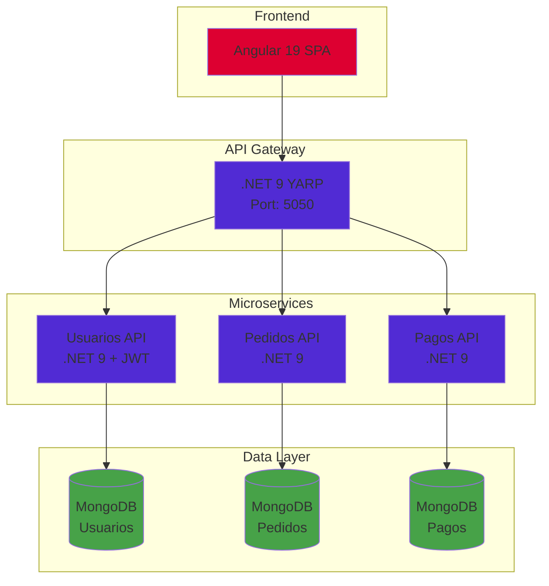
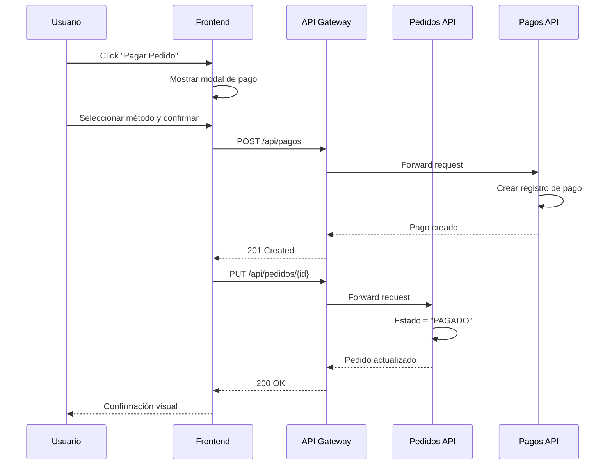

# 🚀 Sistema de Gestión de Pedidos - Microservicios

[](https://dotnet.microsoft.com/)
[](https://angular.io/)
[](https://www.mongodb.com/)
[](https://www.docker.com/)

## 📋 Descripción

Sistema MVP de gestión de pedidos desarrollado con arquitectura de microservicios, diseñado para la empresa ABC como parte de su proceso de migración tecnológica. El proyecto demuestra buenas prácticas de desarrollo, arquitectura limpia y patrones de diseño empresariales.

## ✨ Características Principales

### 🔐 Autenticación JWT (Fase 2)
- **JWT Bearer Authentication**: Tokens seguros con expiración configurable
- **Refresh Tokens**: Renovación automática de sesión sin re-login
- **BCrypt Password Hashing**: Contraseñas almacenadas de forma segura
- **Bloqueo por Intentos Fallidos**: Protección contra ataques de fuerza bruta (5 intentos, 15 min bloqueo)
- **Validación de Contraseñas**: Requisitos de complejidad (mayúscula, minúscula, número)
- **Logout Seguro**: Invalidación de refresh tokens en el servidor

### Backend
- **Respuesta Estándar API**: Formato unificado `ApiResponse<T>` con success, message, data, errors y timestamp
- **Validaciones Robustas**: DataAnnotations en DTOs + validaciones de negocio en servicios
- **Unicidad de Datos**: Validación de email y teléfono únicos en usuarios
- **Búsqueda por Query String**: Filtrado en todos los endpoints GET
- **Health Checks**: Endpoints de salud para monitoreo

### Frontend
- **CRUD Completo**: Gestión de Usuarios, Pedidos y Pagos
- **Dashboard en Tiempo Real**: Estadísticas conectadas a las APIs reales
- **Formularios Reactivos**: Validaciones en tiempo real con Angular Reactive Forms
- **Interceptor HTTP con JWT**: Inyección automática de tokens en todas las peticiones
- **Refresh Token Automático**: Renovación transparente de sesión
- **Simulación de Pagos**: Flujo completo de pago de pedidos (PENDIENTE → PAGADO)
- **Búsqueda con Debounce**: Filtrado eficiente en todas las listas
- **Selección de Usuario en Pedidos**: Lista desplegable al crear pedidos
- **Tema Oscuro/Claro**: Toggle de modo de visualización
- **PWA Ready**: Manifest y configuración para Progressive Web App

## 🏗️ Arquitectura



## 🎯 Justificación Técnica

### ¿Por qué Microservicios?

| Aspecto | Beneficio |
|---------|-----------|
| **Escalabilidad** | Cada servicio escala independientemente según demanda |
| **Despliegue** | CI/CD independiente por servicio |
| **Resiliencia** | Fallo aislado, el sistema continúa operando |
| **Tecnología** | Libertad de elegir stack por servicio |
| **Equipos** | Desarrollo paralelo sin dependencias |

### ¿Por qué Base de Datos por Servicio?

- **Acoplamiento Bajo**: Cada servicio es dueño de sus datos
- **Autonomía**: Cambios de esquema sin afectar otros servicios
- **Optimización**: Modelo de datos específico por dominio
- **Consistencia**: Patrón Database per Service

### ¿Por qué REST?

- **Simplicidad**: Protocolo HTTP estándar
- **Interoperabilidad**: Compatible con cualquier cliente
- **Cacheabilidad**: HTTP caching nativo
- **Documentación**: OpenAPI/Swagger automático

### ¿Por qué Clean Architecture?

```
┌─────────────────────────────────────┐
│           Presentation              │  ← Controllers, DTOs
├─────────────────────────────────────┤
│           Application               │  ← Use Cases, Services
├─────────────────────────────────────┤
│             Domain                  │  ← Entities, Interfaces
├─────────────────────────────────────┤
│          Infrastructure             │  ← MongoDB, External APIs
└─────────────────────────────────────┘
```

- **Independencia**: El dominio no conoce detalles externos
- **Testabilidad**: Capas desacopladas, fácil testing
- **Mantenibilidad**: Cambios localizados por capa
- **Flexibilidad**: Cambiar infraestructura sin tocar negocio

## 📁 Estructura del Repositorio

```
/
├── frontend/                    # Angular 19 SPA
│   ├── src/
│   │   ├── app/
│   │   │   ├── core/           # Guards, Interceptors, Services
│   │   │   ├── features/       # Módulos por funcionalidad
│   │   │   ├── shared/         # Componentes compartidos
│   │   │   └── layout/         # Layout principal
│   │   └── environments/
│   └── Dockerfile
│
├── backend/
│   ├── gateway/                # API Gateway (YARP)
│   │   ├── Gateway.API/
│   │   │   ├── Middleware/     # Error Handling, Logging
│   │   │   └── Program.cs
│   │   └── Dockerfile
│   │
│   ├── usuarios/               # Microservicio de Usuarios
│   │   ├── src/
│   │   │   ├── Usuarios.Domain/
│   │   │   ├── Usuarios.Application/
│   │   │   ├── Usuarios.Infrastructure/
│   │   │   └── Usuarios.API/
│   │   └── Dockerfile
│   │
│   ├── pedidos/                # Microservicio de Pedidos
│   │   ├── src/
│   │   │   ├── Pedidos.Domain/
│   │   │   ├── Pedidos.Application/
│   │   │   ├── Pedidos.Infrastructure/
│   │   │   └── Pedidos.API/
│   │   └── Dockerfile
│   │
│   └── pagos/                  # Microservicio de Pagos
│       ├── src/
│       │   ├── Pagos.Domain/
│       │   ├── Pagos.Application/
│       │   ├── Pagos.Infrastructure/
│       │   └── Pagos.API/
│       └── Dockerfile
│
├── arquitectura/               # Documentación técnica
│   ├── DECISIONS.md
│   └── diagrams/
│
├── docker-compose.yml
└── README.md
```

## 🚀 Inicio Rápido

### Prerrequisitos

- Docker Desktop 4.x+
- Docker Compose 2.x+

### Ejecutar con Docker

```bash
# Clonar el repositorio
git clone <repository-url>
cd NexosSoftware

# Construir y levantar todos los servicios
docker-compose up --build

# O en modo detached
docker-compose up --build -d
```

### URLs de Acceso

| Servicio | URL | Descripción |
|----------|-----|-------------|
| **Frontend** | http://localhost:4200 | Angular SPA |
| **API Gateway** | http://localhost:5050 | Punto de entrada único |
| **Usuarios API** | http://localhost:5001/swagger | Swagger UI (directo) |
| **Pedidos API** | http://localhost:5002/swagger | Swagger UI (directo) |
| **Pagos API** | http://localhost:5003/swagger | Swagger UI (directo) |

> 💡 **Nota**: El frontend se comunica exclusivamente con el API Gateway (puerto 5050), que enruta las peticiones a los microservicios correspondientes.

### Credenciales de Prueba (JWT)

Para crear los usuarios de prueba, ejecuta el endpoint de seed:
```bash
curl -X POST http://localhost:5001/api/seed/usuarios
```

| Usuario | Email | Contraseña | Rol |
|---------|-------|------------|-----|
| Admin Sistema | admin@nexos.com | Admin123! | Admin (acceso completo) |
| Juan Pérez | juan@example.com | Juan123! | Usuario |
| María García | maria@example.com | Maria123! | Usuario |
| Carlos López | carlos@example.com | Carlos123! | Usuario |
| Ana Martínez | ana@example.com | Ana12345! | Usuario |

> ⚠️ **Nota**: Las contraseñas deben cumplir: mínimo 6 caracteres, al menos una mayúscula, una minúscula y un número.

### Health Checks

```bash
# Verificar estado del API Gateway
curl http://localhost:5050/health

# Verificar estado de los microservicios (directo)
curl http://localhost:5001/health
curl http://localhost:5002/health
curl http://localhost:5003/health

# O a través del Gateway
curl http://localhost:5050/api/usuarios/health
curl http://localhost:5050/api/pedidos/health
curl http://localhost:5050/api/pagos/health
```

## 🔌 API Externa Integrada

El frontend consume datos de la API pública:

**JSONPlaceholder**: https://jsonplaceholder.typicode.com

- `/users` - Lista de usuarios
- `/posts` - Lista de publicaciones
- `/todos` - Lista de tareas

## 📸 Capturas de Pantalla

### Login


### Dashboard Admin


### Dashboard Usuario


### Modo Oscuro


## 🛠️ Comandos Útiles

```bash
# Usar el script de ayuda
./scripts/run.sh start    # Construir e iniciar servicios
./scripts/run.sh stop     # Detener servicios
./scripts/run.sh logs     # Ver logs
./scripts/run.sh status   # Estado de contenedores
./scripts/run.sh health   # Verificar health checks
./scripts/run.sh clean    # Limpiar todo

# O comandos Docker directos
# Ver logs de todos los servicios
docker-compose logs -f

# Ver logs de un servicio específico
docker-compose logs -f usuarios-api

# Detener todos los servicios
docker-compose down

# Limpiar volúmenes (bases de datos)
docker-compose down -v

# Reconstruir un servicio específico
docker-compose up --build usuarios-api
```

## 📊 Endpoints por Servicio

### API Gateway (Puerto 5050)

| Método | Endpoint | Descripción |
|--------|----------|-------------|
| GET | /health | Health check del Gateway |
| * | /api/usuarios/* | Proxy a Usuarios API |
| * | /api/pedidos/* | Proxy a Pedidos API |
| * | /api/pagos/* | Proxy a Pagos API |
| * | /api/auth/* | Proxy a Auth (Usuarios API) |

### Autenticación (Puerto 5050 vía Gateway)

| Método | Endpoint | Descripción |
|--------|----------|-------------|
| POST | /api/auth/login | Iniciar sesión (retorna JWT) |
| POST | /api/auth/register | Registrar nuevo usuario |
| POST | /api/auth/refresh | Renovar token JWT |
| POST | /api/auth/logout | Cerrar sesión |
| GET | /api/auth/me | Obtener usuario actual |

### Usuarios API (Puerto 5001)

| Método | Endpoint | Descripción |
|--------|----------|-------------|
| GET | /health | Health check |
| GET | /status | Estado del servicio |
| GET | /api/usuarios | Listar usuarios (soporta `?search=`) |
| GET | /api/usuarios/{id} | Obtener usuario |
| POST | /api/usuarios | Crear usuario (valida unicidad email/teléfono) |
| PUT | /api/usuarios/{id} | Actualizar usuario |
| DELETE | /api/usuarios/{id} | Eliminar usuario |

### Pedidos API (Puerto 5002)

| Método | Endpoint | Descripción |
|--------|----------|-------------|
| GET | /health | Health check |
| GET | /status | Estado del servicio |
| GET | /api/pedidos | Listar pedidos (soporta `?search=`) |
| GET | /api/pedidos/{id} | Obtener pedido |
| GET | /api/pedidos/usuario/{usuarioId} | Pedidos por usuario |
| POST | /api/pedidos | Crear pedido |
| PUT | /api/pedidos/{id} | Actualizar pedido |
| DELETE | /api/pedidos/{id} | Eliminar pedido |

### Pagos API (Puerto 5003)

| Método | Endpoint | Descripción |
|--------|----------|-------------|
| GET | /health | Health check |
| GET | /status | Estado del servicio |
| GET | /api/pagos | Listar pagos (soporta `?search=`) |
| GET | /api/pagos/{id} | Obtener pago |
| GET | /api/pagos/pedido/{pedidoId} | Pagos por pedido |
| GET | /api/pagos/usuario/{usuarioId} | Pagos por usuario |
| POST | /api/pagos | Registrar pago |
| PUT | /api/pagos/{id} | Actualizar pago |
| DELETE | /api/pagos/{id} | Eliminar pago |

## 📦 Formato de Respuesta Estándar

Todas las APIs responden con el siguiente formato:

```json
{
  "success": true,
  "message": "Operación exitosa",
  "data": { ... },
  "errors": [],
  "timestamp": "2026-03-02T12:00:00Z",
  "traceId": "abc123"
}
```

### Códigos de Estado HTTP

| Código | Descripción | Uso |
|--------|-------------|-----|
| 200 | OK | Operación exitosa |
| 201 | Created | Recurso creado |
| 400 | Bad Request | Datos inválidos / Error de validación |
| 404 | Not Found | Recurso no encontrado |
| 409 | Conflict | Email o teléfono duplicado |
| 500 | Internal Error | Error del servidor |

## 🧪 Testing

```bash
# Ejecutar tests del backend
cd backend/usuarios && dotnet test
cd backend/pedidos && dotnet test
cd backend/pagos && dotnet test

# Ejecutar tests del frontend
cd frontend && npm test
```

## � Validaciones Implementadas

### Backend - Usuarios
| Campo | Validación |
|-------|------------|
| Nombre | Requerido, 2-100 caracteres |
| Email | Requerido, formato válido, único |
| Teléfono | Requerido, formato válido, único |
| Rol | Máximo 50 caracteres |

### Frontend - Formularios
- Validación en tiempo real con Reactive Forms
- Mensajes de error específicos por campo
- Indicadores visuales de campos inválidos
- Botón submit deshabilitado si hay errores

## 🎯 Flujo de Pago



## �📝 Licencia

Este proyecto fue desarrollado como prueba técnica para la empresa ABC.

---

**Desarrollado con ❤️ usando .NET 9, Angular 19 y MongoDB**
