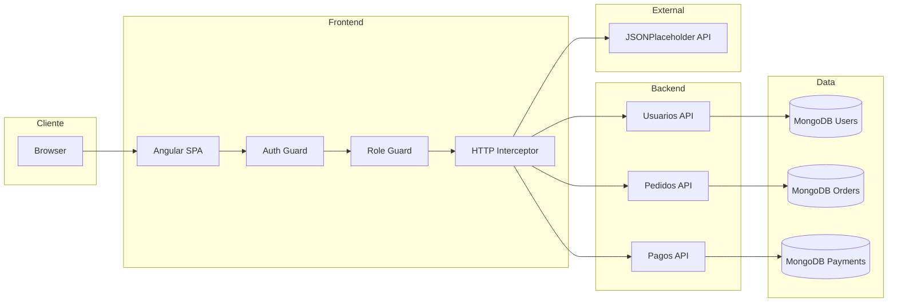
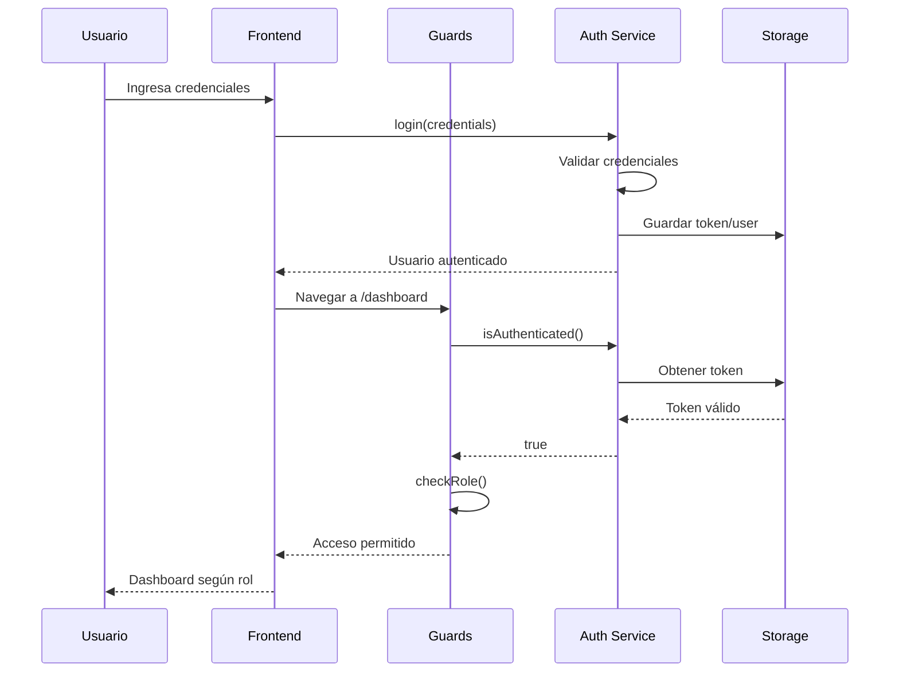

# 📐 Decisiones de Arquitectura

## Documento de Registro de Decisiones Arquitectónicas (ADR)

---

## ADR-001: Arquitectura de Microservicios

### Estado
Aceptado

### Contexto
La empresa ABC necesita migrar su sistema monolítico de gestión de pedidos a una arquitectura moderna que permita escalabilidad, mantenibilidad y despliegue independiente.

### Decisión
Adoptar arquitectura de microservicios con tres servicios principales:
- **Usuarios**: Gestión de identidad y perfiles
- **Pedidos**: Gestión del ciclo de vida de pedidos
- **Pagos**: Procesamiento de transacciones

### Consecuencias
**Positivas:**
- Escalabilidad horizontal por servicio
- Despliegue independiente
- Aislamiento de fallos
- Libertad tecnológica por servicio

**Negativas:**
- Mayor complejidad operacional
- Latencia de red entre servicios
- Consistencia eventual vs inmediata

---

## ADR-002: Base de Datos por Servicio

### Estado
Aceptado

### Contexto
Necesitamos definir la estrategia de persistencia para los microservicios.

### Decisión
Implementar el patrón **Database per Service** con MongoDB independiente para cada microservicio.

### Justificación
```
┌─────────────────┐     ┌─────────────────┐     ┌─────────────────┐
│   Usuarios API  │     │   Pedidos API   │     │    Pagos API    │
└────────┬────────┘     └────────┬────────┘     └────────┬────────┘
         │                       │                       │
         ▼                       ▼                       ▼
┌─────────────────┐     ┌─────────────────┐     ┌─────────────────┐
│  MongoDB Users  │     │ MongoDB Orders  │     │ MongoDB Payments│
└─────────────────┘     └─────────────────┘     └─────────────────┘
```

**Beneficios:**
- Cada servicio es dueño de sus datos
- Sin acoplamiento a nivel de datos
- Optimización de esquema por dominio
- Escalado independiente de storage

---

## ADR-003: Comunicación REST

### Estado
Aceptado

### Contexto
Definir el protocolo de comunicación entre servicios y con clientes.

### Decisión
Utilizar REST sobre HTTP/HTTPS como protocolo de comunicación.

### Alternativas Consideradas

| Opción | Pros | Contras |
|--------|------|---------|
| REST | Simple, estándar, cacheable | Síncrono, acoplamiento temporal |
| gRPC | Performante, tipado fuerte | Complejidad, debugging |
| Message Queue | Desacoplado, resiliente | Complejidad, eventual consistency |

### Justificación
Para un MVP, REST ofrece el mejor balance entre simplicidad y funcionalidad. La migración a gRPC o eventos puede hacerse incrementalmente.

---

## ADR-004: Clean Architecture

### Estado
Aceptado

### Contexto
Definir la estructura interna de cada microservicio.

### Decisión
Implementar Clean Architecture con cuatro capas:

```
┌─────────────────────────────────────────────────────────────┐
│                         API Layer                            │
│  Controllers │ Middleware │ Filters │ DTOs                  │
├─────────────────────────────────────────────────────────────┤
│                    Application Layer                         │
│  Use Cases │ Services │ Interfaces │ Validators             │
├─────────────────────────────────────────────────────────────┤
│                      Domain Layer                            │
│  Entities │ Value Objects │ Repository Interfaces           │
├─────────────────────────────────────────────────────────────┤
│                   Infrastructure Layer                       │
│  MongoDB │ External APIs │ Logging │ Caching                │
└─────────────────────────────────────────────────────────────┘
```

### Reglas de Dependencia
```
API → Application → Domain ← Infrastructure
```

- Domain no tiene dependencias externas
- Application depende solo de Domain
- Infrastructure implementa interfaces de Domain
- API orquesta todo mediante inyección de dependencias

---

## ADR-005: MongoDB como Base de Datos

### Estado
Aceptado

### Contexto
Seleccionar el motor de base de datos para los microservicios.

### Decisión
Utilizar MongoDB 7.0 como base de datos NoSQL.

### Justificación
- **Flexibilidad de esquema**: Ideal para MVP con modelo en evolución
- **Escalabilidad horizontal**: Sharding nativo
- **Rendimiento**: Optimizado para lecturas
- **JSON nativo**: Mapeo directo con APIs REST
- **Ecosistema .NET**: Driver oficial maduro

---

## ADR-006: Docker para Contenerización

### Estado
Aceptado

### Contexto
Definir la estrategia de despliegue y ambiente de desarrollo.

### Decisión
Contenerizar todos los servicios con Docker y orquestar con Docker Compose.

### Estructura de Contenedores
```yaml
services:
  - frontend (Angular, nginx)
  - usuarios-api (.NET 9)
  - pedidos-api (.NET 9)
  - pagos-api (.NET 9)
  - mongo-usuarios
  - mongo-pedidos
  - mongo-pagos
```

### Beneficios
- Ambiente reproducible
- Desarrollo local idéntico a producción
- Facilita CI/CD
- Aislamiento de dependencias

---

## ADR-007: Angular con Standalone Components

### Estado
Aceptado

### Contexto
Seleccionar framework y arquitectura para el frontend.

### Decisión
Utilizar Angular 19 con arquitectura de componentes standalone.

### Características Implementadas
- **Standalone Components**: Sin NgModules tradicionales
- **Signals**: Reactividad moderna
- **Angular Material**: UI consistente
- **Lazy Loading**: Carga diferida por feature
- **Guards funcionales**: Protección de rutas

---

## ADR-008: Autenticación Simulada

### Estado
Aceptado

### Contexto
Para el MVP no se implementará un sistema de autenticación real.

### Decisión
Implementar autenticación simulada con roles hardcodeados.

### Roles Definidos
| Rol | Permisos |
|-----|----------|
| Admin | Acceso completo a todas las funcionalidades |
| Usuario | Acceso limitado (primeros 3 ítems) |

### Evolución Futura
- Integrar con Identity Server
- Implementar OAuth 2.0 / OpenID Connect
- JWT con refresh tokens

---

## ADR-009: Formato de Respuesta Estándar API

### Estado
Aceptado

### Contexto
Necesitamos un formato consistente de respuesta para todas las APIs que facilite el manejo en el frontend y proporcione información útil para debugging.

### Decisión
Implementar `ApiResponse<T>` como envoltorio estándar para todas las respuestas.

### Estructura
```json
{
  "success": true,
  "message": "Operación exitosa",
  "data": { },
  "errors": [],
  "timestamp": "2026-03-02T12:00:00Z",
  "traceId": "abc123"
}
```

### Métodos Factory
```csharp
ApiResponse<T>.Ok(data, message)           // 200
ApiResponse<T>.Created(data, message)      // 201
ApiResponse<T>.BadRequest(message, errors) // 400
ApiResponse<T>.NotFound(message)           // 404
ApiResponse<T>.Conflict(message, errors)   // 409
```

### Beneficios
- Consistencia en todas las respuestas
- Facilita manejo de errores en frontend
- Incluye timestamp para debugging
- Soporta múltiples errores de validación

---

## ADR-010: Validaciones en Capas

### Estado
Aceptado

### Contexto
Definir dónde y cómo validar los datos de entrada.

### Decisión
Implementar validaciones en múltiples capas:

### Capa de Presentación (DTOs)
```csharp
public record CreateUsuarioDto {
    [Required(ErrorMessage = "El nombre es requerido")]
    [StringLength(100, MinimumLength = 2)]
    public string Nombre { get; init; }

    [Required]
    [EmailAddress(ErrorMessage = "Formato de email inválido")]
    public string Email { get; init; }
}
```

### Capa de Aplicación (Servicios)
```csharp
// Validaciones de negocio
if (await _repository.ExistsByEmailAsync(dto.Email))
    return ServiceResult<T>.Failure("Email ya registrado");
```

### Beneficios
- DataAnnotations: Validación automática, mensajes claros
- Servicios: Reglas de negocio complejas
- Separación de responsabilidades

---

## ADR-011: Patrón ServiceResult para Operaciones de Negocio

### Estado
Aceptado

### Contexto
Necesitamos comunicar el resultado de operaciones de servicio al controlador, incluyendo casos de éxito y diferentes tipos de errores.

### Decisión
Implementar `ServiceResult<T>` para encapsular resultados de operaciones.

### Estructura
```csharp
public class ServiceResult<T> {
    public bool Success { get; }
    public T? Data { get; }
    public string? ErrorMessage { get; }
    public List<string> Errors { get; }
    
    public static ServiceResult<T> Ok(T data);
    public static ServiceResult<T> Failure(string message);
}
```

### Uso en Controlador
```csharp
var result = await _service.CreateAsync(dto);
if (!result.Success) {
    return Conflict(ApiResponse<T>.Conflict(result.ErrorMessage, result.Errors));
}
return Ok(ApiResponse<T>.Ok(result.Data));
```

### Beneficios
- Evita excepciones para flujos de control
- Tipado fuerte de resultados
- Facilita testing
- Código más legible

---

## Diagrama de Componentes



---

## Diagrama de Secuencia - Flujo de Login



---

## Métricas de Calidad

### Objetivos del MVP

| Métrica | Objetivo | Medición |
|---------|----------|----------|
| Disponibilidad | 99% | Health checks |
| Tiempo de respuesta | < 500ms | P95 latencia |
| Cobertura de código | > 70% | Tests unitarios |
| Complejidad ciclomática | < 10 | Por método |

---

## Roadmap Técnico

### Fase 1 (MVP) ✅
- [x] Estructura de microservicios
- [x] Clean Architecture
- [x] CRUD básico
- [x] Dockerización
- [x] Frontend con roles
- [x] Respuesta estándar API (ApiResponse)
- [x] Validaciones con DataAnnotations
- [x] Unicidad de email y teléfono
- [x] Búsqueda por query string
- [x] Simulación de pagos
- [x] Formularios reactivos con validación
- [x] Selección de usuario en pedidos

### Fase 2 (Próxima)
- [ ] API Gateway (Kong/Ocelot)
- [ ] Autenticación real (JWT)
- [ ] Circuit Breaker
- [ ] Distributed Tracing

### Fase 3 (Futura)
- [ ] Event-Driven Architecture
- [ ] CQRS por servicio
- [ ] Kubernetes
- [ ] Service Mesh
